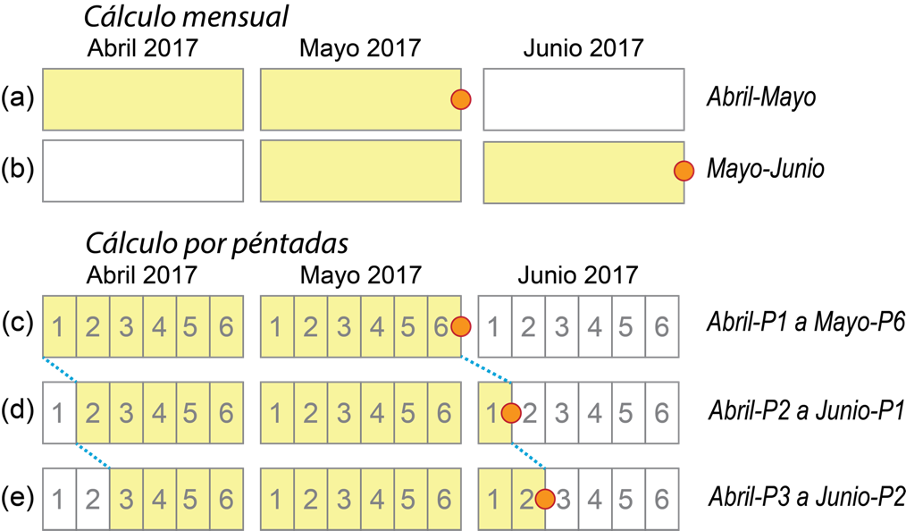

```{r, echo = FALSE, include = FALSE}
# Instalar el paquete pacman que permite instalar y/o cargar los paquetes necesarios
if (!require("pacman")) install.packages("pacman", repos = 'http://cran.us.r-project.org')

# Instalar o cargar los paquetes necesarios
pacman::p_load("dplyr", "here", "fs", "kableExtra", "knitr")

```


El presente documento describe el procedimiento para el cálculo de las estadísticas móviles en alta frecuencia, cada 5 días, a partir de series climáticas sintéticas. Estas estadísticas corresponden a los totales acumulados de precipitación y a la media de temperaturas máxima y mínima agregada a distintas escalas temporales. Si bien se hará hincapié en el uso de series sintéticas, lo mostrado a contiuación es también valido para series observadas ya que pueden ser consideradas como series sintéticas con una única realización.

El cálculo de índices de sequía está dividido en dos etapas: a) calculo de los estadísticas mensuales de precipitación y temperatura y b) cálculo de los índices propiamente dichos. 

# Introducción 

El insumo primario principal para el cálculo de índices de sequía son los valores de variables climáticas (precipitación, temperaturas máxima y mínima) simulados u observados a paso diario. Estos valores se agregan para las distintas escalas temporales definidas previamente. La agregación involucra (a) la suma de precipitaciones diarias y (b) los promedios de temperaturas máximas y mínimas diarias, para la escala temporal seleccionada. Los valores agregados o estadísticos para cada escala temporal se calculan para toda la serie sintética, repitiéndose el cálculo para cada péntada. 
Para el cálculo de valores agregados se implementó un script en lenguaje R (R Development Core Team, 2008) que procesa los datos diarios simulados de las tres variables definidas para todas las localidades (o puntos geográficos) y realizaciones generadas. Este script se ejecuta cada vez que un nuevo set de datos es simulado utilizando el generador estocástico de datos meteorológicos. Si se realiza una nueva simulación con otra configuración del generador, ya sea para otras fechas o localidades, las estadísticas también deben recalcularse porque las nuevas series generadas no serán necesariamente iguales a las originales dado el carácter estocástico del generador. Una vez que ha finalizado el proceso de agregación, los datos obtenidos, de aquí en más llamados estadísticos, se guardan en una base de datos local. 
Dada una fecha de fin de una péntada (días 5, 10, 15, 20, 25 o fin del mes), el proceso se encarga de generar ventanas del ancho correspondiente a cada escala temporal y de computar los estadísticos previamente enumerados con los valores dentro de esa ventana. Luego, el proceso se mueve una péntada hacia adelante y se vuelve a realizar el mismo cómputo. Este proceso iterativo finaliza una vez que se completa la última péntada de la serie simulada. 
Además de los estadísticos, se guarda un registro de todas las tareas realizadas por el script. En este registro se detalla el nombre y origen de las series sintéticas para así asegurar la trazabilidad de los datos de inicio y evitar confusiones en el caso que se realicen múltiples simulaciones mediante el generador. 
Por último, notamos que el uso de series sintéticas tiene la ventaja que éstas no poseen datos faltantes por lo que no es necesario un procesamiento especial para el cálculo de los estadísticos. 

# Agregación de series temporales

El primer paso para el cálculo de los índices de sequía es la agregación de los datos diarios, ya sean series sintéticas u observadas, a escala mensual. En la implementación inicial – antes de la creación del SISSA – la agregación se realizaba por mes calendario. Por ejemplo, para calcular la precipitación acumulada, insumo del SPI, con una escala de 2 meses para Pehuajó en mayo de 2017, se considera la suma de los totales mensuales de lluvia en Pehuajó para abril y mayo de 2017 (2 meses). Esta lógica de cálculo se muestra en la fila (a) de la Figura \@ref(fig:calculo-alta-frecuencia) dónde los datos de lluvia que se incluyen en el cálculo se muestran en amarillo. El uso de meses calendarios implica que los índices de sequía calculados a partir de estas series se actualizan una vez al mes, luego de terminado un mes calendario: el círculo naranja al final de un período indica cuándo está disponible el valor del índice (ignorando retrasos en el cálculo). Con el cálculo tradicional, el siguiente valor de un índice (Figura \@ref(fig:calculo-alta-frecuencia), fila b) recién se podría calcular a fines de junio de 2017, un mes después. En este caso, el valor del índice se calcula con la suma de totales de lluvia para mayo-junio 2017 (marcados con amarillo).
Una actualización más frecuente de los índices permite tomar mejores decisiones ya que no es necesario esperar al cierre del mes en curso para obtener el valor de los índices. La nueva implementación para el cálculo frecuente de estadísticas permite tener un nuevo valor para un índice/escala cada 5 días aproximadamente.

La agregación frecuente de valores mensuales se basa en el concepto de péntadas (período de 5 días consecutivos). Sin embargo, está definición es flexible para adaptarse a distinta circunstancias:  (a) todos los meses tienen 6 péntadas y (b) las cinco primeras péntadas dentro de un mes tienen una duración de 5 días, en tanto que la sexta y última péntada de un mes puede tener 3, 4, 5 o 6 días – para meses con 28, 29, 30 o 31 días, respectivamente. Por ejemplo, la primera péntada de un mes incluye los días 1 a 5 de ese mes, la segunda péntada los días 6 a 10, y así sucesivamente. Una ventaja de esta definición es que las péntadas no cruzan límites de meses, lo que hace fácil la agregación de datos a diferentes escalas. Por ejemplo, el cálculo de totales mensuales de precipitación basados es la suma de totales para las 6 péntadas en cada mes/año.
Con este nuevo enfoque, las estadísticas mensuales se calculan para cada péntada del año. La escala de agregación de las series diarias, las futuras escalas de los índices, se definen en función de péntadas, y no de meses. Para continuar con el ejemplo anterior para Pehuajó, en el cálculo frecuente la agregación se realiza  desde la primera péntada de abril de 2017 (1-5 de abril de 2017) hasta la sexta péntada del mes de mayo de 2017 (26-31 de mayo de 2017). (Figura \@ref(fig:calculo-alta-frecuencia), fila c); las 12 péntadas utilizadas para el cálculo se indican en amarillo. Este período de 12 péntadas o dos meses se denomina como “Abril-P1 a Mayo-P6”, donde P1 y P6 indican la primera y sexta década de un mes, respectivamente. Este intervalo coincide con dos meses calendario, por lo que el valor del índice para la fila (c) debe coincidir con el valor calculado en la fila (a), es decir con el cálculo para meses calendario. 

A continuación, el período de 12 péntadas que corresponde a una escala de dos meses se corre una péntada hacia adelante (líneas punteadas azules en la Figura \@ref(fig:calculo-alta-frecuencia). ). Ahora el período utilizado (Figura \@ref(fig:calculo-alta-frecuencia), fila d) incluye las 12 péntadas entre la segunda péntada de Abril 2017 (Abril-P2) y la primera péntada de Junio 2017 (Junio-P1). En este período, el índice tiene la misma escala temporal que en la fila (c) pero ya no coincide con los meses calendario: comienza el 6 mayo 2017 y termina el 5 junio 2017. En la Figura \@ref(fig:calculo-alta-frecuencia). fila e, se vuelve a desplazar una péntada el período para el cual se calcula el SPI-2, y ahora el cálculo comprende el período entre la tercera péntada de abril y la segunda péntada de Junio 2017 (o sea entre el 11 de Abril y el 10 de Junio de 2017).

Como se ilustró antes, la ventaja más importante del cálculo por péntadas es que los diagnósticos de sequía están disponibles cada cinco días aproximadamente, o sea al final de cada péntada (círculos naranja en las filas c–e de la Figura \@ref(fig:calculo-alta-frecuencia)). Es decir, se dispone de diagnósticos de las condiciones de sequía mucho más frecuentemente que antes (seis veces por mes, en lugar de una).

```{r calculo-alta-frecuencia, eval = TRUE, echo = FALSE, out.width = "70%", fig.align = "center", fig.cap = "Ilustración de la agregación de series temporales por mes calendario (filas a y b) y por péntadas filas c-e). "}
  
```

# Ejemplo de aplicación

Como se mencionó anteriormente, el primer paso para el cálculo de los índices es la agregación de los valores diarios a series mensuales en alta frecuencia. Para ello se debe correr el script `01_estadisticas_moviles.R`. No es necesario modificar nada en el código ya que éste es válido para la agregación de cualquier tipo de serie diaria de precipitación y temperaturas máxima y mínima. Solo se deben modificar los archivos `configuracion_estadisticas_moviles.yml` y `parametros_estadisticas_moviles.yml`. Estos archivos se pueden editar con cualquier editor de texto, incluso con el propio RStudio. A contiuación se muestra la estructura de los archivos de texto y como modificarlos según cada usuario. 
El primero que modificaremos es `configuracion_estadisticas_moviles.yml`. Este archivo define las rutas a las distintas carpetas donde se almacenarán los resultados y la cantidad de máxima de procesos que pueden realizarse en paralelo. 
```{r comment='', echo = FALSE}
cat(readLines('/Users/alessiobocco/Documents/Documentos/SISSA/Devel/indices-eventos/EstadisticasMoviles/configuracion_estadisticas_moviles.yml'), sep = '\n')
```

El primer bloque corresponde a las rutas. Se deben definir cuatro rutas:

* `base`: corresponde a la ruta donde se encuentra el proyecto. 
*  `run`: corresponde a la ruta donde se guardarán los logs de cada una de las tareas realizadas. Puede crearla manualmente como una subcarpeta dentro del directorio base o solo especificarla y el script la creará automáticamente. Siempre debe ser una subcarpeta dentro de `base`. 
* `lib`:  corresponde a la ruta donde se encuentran los scripts desarrollados por el SISSA. Esta carpeta no se encuentra junto al proyecto sino un nivel más arriba dentro de `indices-eventos`. 
* `data `: corresponde a la ruta donde se encuentran los datos diarios de entrada para el cálculo de las estadísticas móviles. Esta carpeta no se encuentra junto al proyecto sino un nivel más arriba dentro de `indices-eventos`. 

En el segundo bloque se deben definir la cantidad de procesos en paralelo que pueden llevarse adelante. La mayoría de las computadoras personales hoy poseen más de un núcleo lo que aumenta en gran medida el poder de cómputo. Se recomienda elegir una cantidad de núcleos tal que permita seguir utilizando la computadora con fluidez, en el caso que se trate de una computadora personal. Si se deconoce la cantidad de nucleos puede escribir lo siquiente en la consola. 

```{r, message=FALSE}
require(parallel)
parallel::detectCores()
```

La función `detectCores()` del paquete `parallel` permite identificar la cantidad de núcleos disponibles. En este caso son 8 pero se recomendaría usar 6 para así dejar dos disponibles para otras tareas. 

El segundo archivo de texto que debe modificarse es `parametros_estadisticas_moviles.yml`. Este archivo define las características que tendrá el proceso de agregación desde el ancho de las ventanas (escalas de interés), pasando por la política de faltantes hasta las funciones de agregación. 

```{r comment='', echo = FALSE}
cat(readLines('/Users/alessiobocco/Documents/Documentos/SISSA/Devel/indices-eventos/EstadisticasMoviles/parametros_estadisticas_moviles.yml'), sep = '\n')
```

El primer bloque de este documento define las escalas de agregación de los valores diarios.Es decir, la cantidad de péntadas que tendrá la vetana de agregación. Se puede utilizar varias escalas con un mínimpo de 6 (1 mes) hasta 288 (48 meses), sólo se deben separar los valores con comas tal como muestra el ejemplo. 

El segundo bloque corresponde a las políticas de datos faltantes. Si los datos de entrada son series sintéticas, éstas no tendrán faltantes y el usuario puede obviar este bloque ya no tendrá ningún efecto. Si en cambio se utilizan series observadas se debe proceder de la siguiente manera. Por cada ancho de ventana y variable se debe definir una política. Por ejemplo, como se observa en la primera fila de este bloque, el ancho de vetana 6 tiene tres políticas, dos para temperaturas máxima y mínima y uno para precipitación. Las temperaturas tienen dos argumentos, la cantidad máxima dentro de la ventana y la cantidad de faltantes consecutivos mientra que para la precipitación sólo se especifica una cantidad máxima de faltantes. Siguiendo con el ejemplo para el ancho de ventana 6, la temperatura máxima ("tmax") solo permite un cantidad de máxima ("maximo") de 5 faltantes con no más de 3 faltantes consecutivos ("consecutivos"). Si esta condición no se cumple, toda la ventana será reemplazada por NA. La temperatura mínima ("tmin") tiene la misma política de faltantes. Por último, para la precipitación ("prcp") sólo se especifica la cantidad máxima de faltantes tolerados, en este ejemplo, 3. Cabe mencionar que a medida que el ancho de ventana es mayor, la cantidad de faltantes máxima para cada una de las variables se flexibiliza. Esta política del ejemplo es solo a título demostrativo y el usuario puede definirla como mejor crea conveniente. 

En último bloque del documento se definen las funciones de agregación para cada una de las variables junto a algunos diagnósticos como la cantidad de faltantes. Para el caso de las temperaturas máxima y mínima se calcularán las siguientes variables: 
* Media: media de los valores de temperatura por ventana
* Mediana: mediana de los valores de temperatura por ventana
* Desvío estándar: desvío estándar de los valores de temperatura por ventana
* MAD: desvío absoluto medio de los valores de temperatura por ventana (Mean absolute deviation)
* NFaltantes: cantidad de faltantes por ventana
* NDisponibles: cantidad de datos disponibles por ventana

Para el caso de la precipitación las variables calculadas son:

* Suma: total acumulado por ventana
* Ocurrencia: cantidad de días lluviosos por ventana
* Media: media de la precipitación por ventana
* Mediana: mediana de la precipitación por ventana
* Desvío estándar: desvío estándar de la precipitación por ventana
* MAD:desvío absoluto medio por ventana (Mean absolute deviation)
* NFaltantes: cantidad de faltantes por ventana
* NDisponibles: cantidad de datos disponibles por ventana

Una vez completado los archivos de configuración y parámetros, sólo queda abrir el script y ejecutarlo. A modo de ejemplo se mostrarán a continuación algunos resultados. En la subcarpeta `data` dentro del directorio raíz `indices-eventos` se creará una carpeta llamada `parital`. Dentro de la misma se guardarán los resultados intermedios de todos los procesos. 

```{r}
estadisticas_moviles <- vroom::vroom('/Users/alessiobocco/Documents/Documentos/SISSA/Devel/indices-eventos/data/partial/estadisticas_moviles_id1.csv')
```

A continuación, se muestran las primeras 10 filas de la tabla con los resultados del proceso de agregación. Las variables que posee la Tabla son las siguientes:

* `station_id` : Código unívoco que identifica a la estación meteorológica
* `point_id` : Código unívoco que representa a cada punto de la simulación. Esta variable cobra sentido cuando se simula sobre un grilla o en locaciones arbitrarias donde no hay un identificador previo para el punto. Si los datos a agregar solo corresponden a estaciones meteorológicas, esta columna podría descartarse.
* `variable_id`: Identificador de las variables agregadas que corresponde a precipitación (prcp), temperaturas máxima (tmax) y mínima (tmin). 
* `ancho_ventana_pentadas`: Cantidad de péntadas usadas para la agregación. En el caso del ejemplo, 6 péntadas (6 péntadas x 5 días/péntada = 30 días) quiere decir que los valores de las variables se agregan a una escala mensual. Este valor se determina en el archivo de configuración como se mostró más arriba. 
* `fecha_desde`: Fecha de comienza de la ventana, es decir, primer día de la ventana. 
* `fecha_hasta`: Fecha de fin de la ventana de agregación, es decir, último día de la ventana. 
* `realización`: Identificador de la realización. En el caso de que se trato de series observadas, la cantidad de realizaciones será una sola. 
* `metodo_imputacion_id`: Código unívoco de identifiación del método de imputación. 
* `estadistico`: Nombre del estadístico utilizado para la agregación. 
* `valor`: Valor del estadístico correspondiente a cada ventana/año.

```{r, echo = FALSE}
knitr::kable(estadisticas_moviles[1:10,], "latex", booktabs = T) %>%
  kableExtra::kable_styling(position = "center",
                            latex_options = c("striped", "scale_down")) %>%
  kableExtra::scroll_box(width = "100%", height = "200px")
```
Como se observa, la tabla tiene un formato largo. Es decir, las variables y los estadísticos usados en el proceso de agregación se encuentran en las filas y no en las columnas. Para continuar con el proceso de cálculo de índices, éste es el formato que debe tener pero si se desea explorar los resultados en un formato más amigable se puede hacer lo siguiente. 

Este dataset de ejemplo contiene 50 realizaciones para la estación meteorológica de Villa Reynolds (San Luis, Argentina) y agregada con dos ancho de vetana diferente: 6 péntadas (1 mes) y 18 péntadas (3 meses).

```{r}
# Cantidad de realizaciones
unique(estadisticas_moviles$realizacion)
# Ancho de vetana de agregación
unique(estadisticas_moviles$ancho_ventana_pentadas)
```

Si el usuario desea utilizar los valores agregados puede transformar la tabla de formato largo a ancho. En el siguiente ejemplo se utilizan las medias mesuales de temperaturas máxima y mínima y los totales acumulados de precipitación. 

```{r}
# Filtrar estadísticos por cada variable:
# Suma de precipitación y media de temperaturas máxima y mínima.
estadisticas_moviles_ancho <- estadisticas_moviles %>%
  dplyr::filter((
    # Filtrar la temperatura máxima media
    (variable_id == 'tmax' & estadistico == 'Media') |
    # Filtrar la temperatura mínima media
   (variable_id == 'tmin' & estadistico == 'Media') |
   # Filtrar los totales de precipitación
  (variable_id == 'prcp' & estadistico == 'Suma')) &
    # Filtrar los valores agregados a una ventana de 6 péntadas (30 días)
    ancho_ventana_pentadas == 6) %>%
  # Seleccionar las variables station_id, realizacion, variable_id, fecha_desde, fecha_hasta y valor
  dplyr::select(station_id, realizacion, variable_id, fecha_desde, fecha_hasta, valor) %>%
  # Convertir la tabla de formato largo a ancho
  tidyr::spread(variable_id, valor) 

# Estructura de la tabla transformada
estadisticas_moviles_ancho %>%
  dplyr::slice(1:10) %>%
  knitr::kable() %>%
  kableExtra::kable_styling() %>%
  kableExtra::scroll_box(width = "100%", height = "200px")
```

Para visualizar los efectos de la agregación en alta frecuencia se muestra un fragmento de 5 años de la tabla anterior. Como se mencionó, este dataset posee 50 realizaciones pero aquí solo se filtra una para optimizar la visualización. 

```{r}
highcharter::highchart() %>%
  highcharter::hc_add_series(data = estadisticas_moviles_ancho %>% 
                               dplyr::filter(realizacion == 1, fecha_desde < as.Date('1965-01-01')), type = "line", visible = TRUE, 
                             showInLegend = TRUE, name = "Temperatura máxima", zIndex = 2, 
                             tooltip = list(valueSuffix = " [°C]", valueDecimals = 1),
                             mapping = highcharter::hcaes(x = fecha_desde, y = tmax)) %>%
  highcharter::hc_add_series(data = estadisticas_moviles_ancho %>% 
                               dplyr::filter(realizacion == 1, fecha_desde < as.Date('1965-01-01')), type = "line", visible = TRUE, zIndex = 1,
                             tooltip = list(valueSuffix = " [°C]", valueDecimals = 1),
                             showInLegend = TRUE, name = "Temperatura mínima",
                             mapping = highcharter::hcaes(x = fecha_desde, y = tmin)) %>%
  highcharter::hc_xAxis(type = 'datetime', title = list(text = "Fecha")) %>%
  highcharter::hc_yAxis_multiples(
    list(title = list(text = "Temperatura [°C]"), min = -10, max = 50),
    list(opposite = FALSE, title = list(text = " "))
  ) %>%
  highcharter::hc_chart(type = 'line', zoomType = 'x', panning = TRUE, panKey = 'shift') %>%
  highcharter::hc_legend(enabled = TRUE, layout = "horizontal") %>%
  highcharter::hc_tooltip(shared = TRUE) %>%
  highcharter::hc_colors(c("#fc8d62", "#a6cee3")) %>%
  highcharter::hc_title(text = "Temperaturas máxima y mínima de Villa Reynolds (San Luis, Argentina)") %>%
  highcharter::hc_add_theme(highcharter::hc_theme_elementary()) %>%
  highcharter::hc_plotOptions(
    series = list(
      marker = list(
        enabled = TRUE,
        symbol = 'diamond',
        radius = 5,
        lineWidth = 0,
        states = list(
          hover = list(
            enabled = F
          )
        )
      )
    ),
    column = list(
      borderWidth = 0
    )
  )

```


